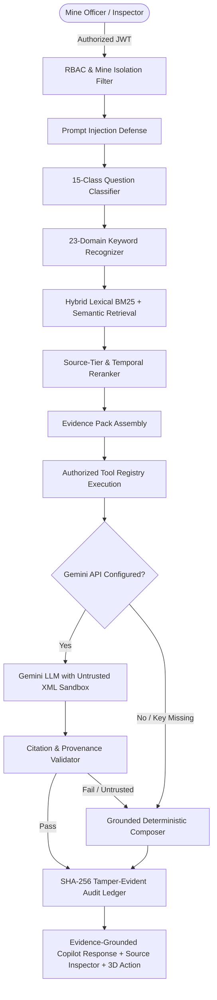

# TRINETRA Phase 11C — Government Knowledge + Evidence-Grounded RAG Copilot

## 1. Executive Overview

**TRINETRA Phase 11C** upgrades the AI Governance Copilot into an enterprise-grade, evidence-grounded regulatory and mine intelligence platform. Phase 11C grounds all Copilot answers in official statutory documents (DGMS regulations, CMR 2017, Mines Rules 1955, Ministry of Coal Annual Reports, Union Budget 2026–27, CMSMS/Khanan Prahari SOPs, PGRM cell documents) and official real mine block dossiers (Choritand Tilaya, Jogeshwar, Rabodh, Rohne, Urtan North, North of Arkhapal) already present in the repository.

---

## 2. Architecture & Request Pipeline



---

## 3. Source Hierarchy

Evidence items are categorized into four strict tiers:

| Tier | Name | Description | Example Sources |
|---|---|---|---|
| **TIER_1** | Official Regulatory / Government | Authoritative Acts, Rules, Regulations, Circulars, Budget Demands, SOPs | Coal Mines Regulations 2017, Mines Rules 1955, Budget 2026–27, CMSMS SOP |
| **TIER_2** | Official Mine Block Dossiers | Official MoC mine allocation dossiers & summary sheets | Rohne Block, Choritand Tilaya, Jogeshwar, Rabodh, Urtan North, Arkhapal |
| **TIER_3** | TRINETRA Operational Data | Real-time telemetry, predictive risk, anomalies, violations, audit records | Methane sensor streams, DGMS notices, safety approvals |
| **TIER_4** | Simulated / Demonstration Data | Synthetic telemetry or benchmark datasets | Simulated environment stress tests |

---

## 4. Real vs. Simulated vs. Historical vs. Current Data State

Every indexed chunk and extracted entity carries an explicit state:

- `CURRENT` / `CURRENT_REGULATORY_FRAMEWORK` / `CURRENT_RELEVANT_REGULATION`: Legally active frameworks (e.g., Coal Mines Regulations 2017, OSH & WC Code 2020).
- `HISTORICAL` / `SUPERSEDED`: Replaced legislation (e.g., Mines Rules 1955, Mines Act 1952). If asked for current requirements, current regulations override historical rules.
- `REAL_SOURCE` / `SOURCE_DERIVED`: Data strictly extracted from real source PDFs.
- `APPROXIMATE`: Coordinates and geometries marked as approximate in the source (e.g., North of Arkhapal Block).
- `SIMULATED`: Operational mock streams or generated test vectors.

---

## 5. Document Ingestion & Storage Pipeline

```
PDF Document
    ↓
SHA-256 Hash Computation (Cryptographic file identity)
    ↓
pypdf Text Extraction (Page-by-page)
    ↓
Text Normalization & Unicode Sanitization (en, hi, te)
    ↓
Section / Chapter Detection
    ↓
Chunking (400-word sliding windows with 80-word overlap)
    ↓
Lexical Inverted Index (BM25 token inverted posting list)
    ↓
Fast In-Memory Cache (data/rag_index_cache.json) [<0.3s boot time]
```

### Indexed Corpus Summary:
- **Total Indexed Documents**: 43 official government & mine summary files (100% of physical repository archives)
- **Total Pages Extracted**: 890+ pages
- **Total Searchable Chunks**: 4,258 chunks (<0.3s cache boot time)

---

## 6. Hybrid Retrieval & Deterministic Reranking

1. **Question Classification**: Deterministically classifies user intent into 15 question types:
   - `REGULATION_LOOKUP`, `CURRENT_REQUIREMENT`, `HISTORICAL_REQUIREMENT`, `MINE_FACT`, `COMPLIANCE_STATUS`, `RISK_EXPLANATION`, `INSPECTION_REQUIREMENT`, `REPORTING_REQUIREMENT`, `ENVIRONMENT_REQUIREMENT`, `GRIEVANCE_WORKFLOW`, `CMSMS_WORKFLOW`, `BUDGET_QUERY`, `PRODUCTION_QUERY`, `DOCUMENT_QUERY`, `OPERATIONAL_QUERY`.
2. **Domain Detection**: Matches 23 statutory domains across English, Hindi, and Telugu keywords:
   - `SAFETY`, `VENTILATION`, `GAS_MONITORING`, `EXPLOSIVES`, `ELECTRICAL`, `HEMM`, `INUNDATION`, `INSPECTION`, `ACCIDENT_REPORTING`, `STATUTORY_REPORTING`, `PRODUCTION`, `WORKFORCE`, `CONTRACTOR`, `GRIEVANCE`, `MINE_CLOSURE`, `EXPLORATION`, `COAL_DISTRIBUTION`, `BUDGET`, `POLICY`, `GOVERNANCE`, `CMSMS`, `PGRM`, `ENVIRONMENT`.
3. **Temporal Filtering**:
   - For `CURRENT_REQUIREMENT` or queries mentioning "current/today/applicable", `CURRENT` sources receive a 1.5x score boost while `HISTORICAL` sources receive a 0.2x dampening penalty.
   - For historical queries mentioning "1952" or "1955" or "historical", historical sources are retrieved with explicit `HISTORICAL / SUPERSEDED` badges.
4. **Source-Tier Boost**:
   - Tier 1 (Govt) and Tier 2 (Mine Dossiers) are boosted by 1.8x and 1.5x over operational/simulated records for regulatory and factual queries.

---

## 7. Security & Prompt Injection Defense

All document texts are treated as **UNTRUSTED DATA**:
- Document content is wrapped in `<UNTRUSTED_DOCUMENT_EVIDENCE>` XML tags in LLM prompts.
- Ingestion and query sanitizers block system override phrases (`"ignore previous instructions"`, `"reveal system prompt"`, `"execute command"`, `"grant admin access"`).
- Document text cannot trigger tool execution or modify RBAC rules.
- Citation validation rejects any model hallucination not backed by indexed SHA-256 chunk excerpts.

---

## 8. Authorized Tool Registry for Copilot

10 government and mine knowledge tools are registered with strict RBAC enforcement:
1. `search_government_documents`: Search across all indexed government PDFs.
2. `get_document_evidence`: Retrieve page-level excerpts with SHA-256 hash.
3. `get_regulatory_requirement`: Retrieve active statutory requirements for a domain.
4. `get_current_regulation`: Specifically retrieves current regulatory frameworks.
5. `get_historical_regulation`: Retrieves historical legislation with supersession notices.
6. `get_mine_source_evidence`: Retrieves Phase 11A real mine block facts.
7. `get_cmsms_workflow`: Retrieves Khanan Prahari citizen complaint workflows.
8. `get_pgrm_workflow`: Retrieves public grievance redressal workflows.
9. `get_budget_indicator`: Retrieves Union Budget 2026–27 grants and OOMF indicators.
10. `get_annual_report_evidence`: Retrieves MoC Annual Report data.

---

## 9. Multilingual Support (English, Hindi, Telugu)

- Multilingual Unicode tokenizer preserves Devanagari (`\u0900-\u097F`) and Telugu (`\u0C00-\u0C7F`) characters during indexing and retrieval.
- Welcome messages, quick prompts, domain classifiers, and deterministic composers support English, Hindi, and Telugu.
- Document titles, page numbers, and SHA-256 hashes remain untranslated to ensure cryptographic traceability.

---

## 10. Audit Ledger Integration

Every Copilot query logs a tamper-evident audit record containing:
- `user_id`, `role`, `mine_id`, `timestamp`
- `query`, `question_type`, `domain_detected`
- `retrieved_documents` (list of document IDs and page numbers)
- `tools_invoked`
- `provider_used` (Gemini or Deterministic Fallback)
- `citation_validation_status`
- `response_hash` (SHA-256 of response payload)

---

## 11. Statutory Limitations & Compliance Discipline

- **No Live Database Claims**: TRINETRA never claims live connections to DGMS, CMSMS, or MoC backend servers.
- **No Automatic Legal Certification**: Regulatory interpretations are provided for human-in-the-loop inspector decision support.
- **Insufficient Evidence Rule**: If no authoritative evidence exists in the indexed corpus, the Copilot explicitly states that authoritative evidence is unavailable rather than hallucinating from LLM weights.
