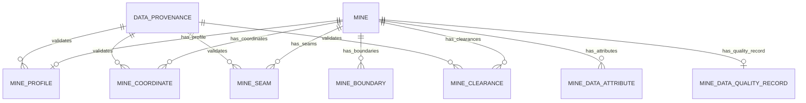

# TRINETRA (त्रिनेत्र) — Real Mine Data Foundation, Ingestion & Provenance Architecture
**Phase 11A Technical Specification & Governance Reference**
*Version: 1.0.0 (Phase 11A)*

---

## 1. Executive Summary & Objective

TRINETRA delivers a credible, source-grounded **Real Mine Data Foundation** establishing verifiable ground truth from official Ministry of Coal (MoC) and Central Mine Planning & Design Institute Limited (CMPDI) mine block summaries.

### Absolute Data Integrity Rule:
- **Zero Fabrication**: No dimensions, coordinates, geological reserves, or statutory clearances are invented.
- **NA Preservation**: If an official document marks an attribute as "NA", "Not Available", or "Not Approved", it is preserved verbatim with its explicit legal meaning.
- **Page-Level Provenance**: Every extracted fact links directly to its source document, SHA-256 cryptographic file hash, page number, section heading, authority tier, and trust status.
- **Strict Separation**: Real source-derived data (`is_simulated = NO`, `data_status = SOURCE_DERIVED / APPROXIMATE`) is strictly separated from synthetic demo mines (`is_simulated = YES`, `data_status = SIMULATED`).

---

## 2. Ingested Real Source Documents

TRINETRA deterministically ingests 6 official Coal Block documents into `backend/app/data/source_documents/`:

| Index | Block Name | Source File | State / Coalfield | Document SHA-256 Hash |
| :--- | :--- | :--- | :--- | :--- |
| **66** | **Choritand Tilaya** | `Mine_SUMMARY_66_Choritand_Tilaya.pdf` | Jharkhand / West Bokaro | Computed at runtime |
| **67** | **Jogeshwar** | `Mine_Summary_67_Jogeshwar_Coal_Block.pdf` | Jharkhand / West Bokaro | Computed at runtime |
| **68** | **Rabodh** | `Mine_Summary_68_Rabodh.pdf` | Jharkhand / West Bokaro | Computed at runtime |
| **69** | **Rohne** | `Mine_Summary_69_Rohne.pdf` | Jharkhand / North Karanpura | Computed at runtime |
| **70** | **Urtan North** | `Mine_Summary_70_Urtan_North.pdf` | Madhya Pradesh / Sohagpur | Computed at runtime |
| **71** | **North of Arkhapal** | `Mine_Summary_71_NORTH_OF_ARKHAPAL_Block.pdf` | Odisha / Talcher | Computed at runtime |

---

## 3. Data Trust & Authority Classification

### 3.1 Authority Hierarchy
- `TIER_1_OFFICIAL_REGULATORY`: DGMS Gazette Notifications, MoEFCC EC Orders, Statutory Circulars.
- `TIER_2_OFFICIAL_MINE_BLOCK`: CMPDI Geological Reports, Official Mine Block Summaries, Exploration Reports.
- `TIER_3_TRINETRA_OPERATIONAL`: Field inspection logs, verified sensor telemetry, calibrated IoT streams.
- `TIER_4_SIMULATED_DEMO`: Hackathon demonstration datasets and synthetic simulation scenarios.

### 3.2 Data Trust Status
- `SOURCE_DERIVED`: Directly parsed from an authoritative government document.
- `APPROXIMATE`: Stated as tentative or approximate in the official document (e.g. regionally explored blocks).
- `SCHEMATIC`: Bounding or conceptual geometry for visualization.
- `SIMULATED`: Synthetic test scenario data.
- `USER_ENTERED`: Field inputs without document attachment.
- `UNKNOWN`: Unverified input.

### 3.3 Geometry Status
- `SURVEY_DERIVED`: Total station / DGPS survey grade boundary.
- `SOURCE_DERIVED`: Derived from documented limiting coordinates.
- `APPROXIMATE`: Regionally explored boundary subject to Detailed Exploration.
- `SCHEMATIC`: Simplified bounding polygon.
- `SIMULATED`: Synthetic coordinates for demo faces.

---

## 4. Entity-Relationship Architecture

---

## 5. REST API Specifications

| Method | Endpoint | Description | Scope / RBAC |
| :--- | :--- | :--- | :--- |
| `GET` | `/api/v1/mine-data/real-mines` | List all 6 real coal blocks with summary facts | Authenticated Users |
| `GET` | `/api/v1/mine-data/{mine_id}` | Detailed profile, geology, clearances & provenance | Mine Isolation / Admin / Regulator |
| `GET` | `/api/v1/mine-data/{mine_id}/coordinates` | Cardinal points, WGS84 & CoalGrid projected coordinates | Mine Isolation / Admin / Regulator |
| `GET` | `/api/v1/mine-data/{mine_id}/seams` | Stratigraphic coal seam column & reserves | Mine Isolation / Admin / Regulator |
| `GET` | `/api/v1/mine-data/{mine_id}/clearances` | Statutory clearances and approvals with citations | Mine Isolation / Admin / Regulator |
| `GET` | `/api/v1/mine-data/{mine_id}/provenance` | Complete list of provenance references | Mine Isolation / Admin / Regulator |
| `GET` | `/api/v1/mine-data/{mine_id}/quality` | Data quality score, coverage & approximate flags | Mine Isolation / Admin / Regulator |
| `POST`| `/api/v1/mine-data/ingest-all` | Trigger repeatable document ingestion | `SYSTEM_ADMIN` only |

---

## 6. How Downstream Phases Consume this Foundation

### Phase 11B: 3D Digital Mine Preparation
- Will consume `mine_boundaries`, `mine_coordinates` (preserving WGS84 / CoalGrid datum), and `mine_seams` (thickness and depth intervals).
- Will respect `geometry_status = APPROXIMATE` and render appropriate visual trust indicators rather than claiming survey-grade precision.

### Phase 11C: Evidence-Grounded AI Copilot & RAG
- Will retrieve facts with direct citation tags (`document_filename`, `page_number`, `document_hash`).
- Will answer user queries by citing the exact official page reference.
